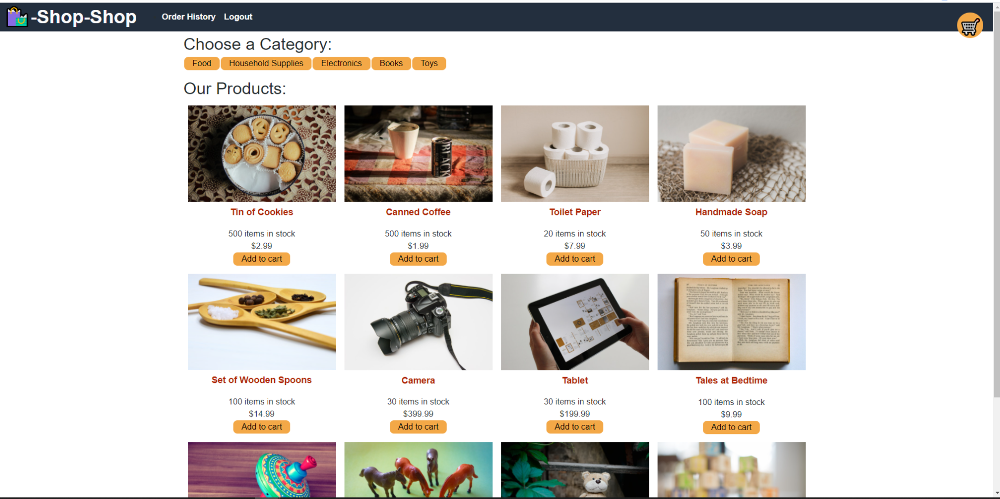

# Shop-Shop (with redux)

### Table Of Contents
* [Installation](#installation)
* [Usage](#usage)
* [Credits](#credits)
* [License](#license)

## Deployed Heroku URL

[Heroku App](https://boiling-brushlands-30162.herokuapp.com/)

## Github Repo URL
[GitHub](https://github.com/carrington13/book-search-engine/)

## Installation
Use `npm install` in root directory to install all dependencies.

## Usage

### Run Command
If in development, run `npm run develop` from root directory to concurrently run both React and API servers.
For API server only, run `npm run start` or `npm run watch` to run server with nodemon.

### Description
An e-commerce app that "sells" items that implements the test version of stripe for payments. Originally built using React's Context API, it is now refactored to use Redux to manage its global state.

### Languages, Frameworks, and other Libraries
MERN-stack, GraphQL, Apollo-server-express, apollo-boost,jsonwebtoken/JWT, mongoose, dotenv, bcrypt, react, Redux, react-redux, apollo-link-context, Stripe

### Tests
React Tests will be added at a later date

### Tutorials

#### Full Walk-through

### Questions
##### GitHub
[Carrington13](https://github.com/Carrington13)
##### Email
caseyarrington13@gmail.com

## Credits

Starter Code with Context API - Provided by:
Trilogy Education 

Conversion to Redux - By:
Casey Arrington

[License Badges and Links](https://gist.github.com/lukas-h/2a5d00690736b4c3a7ba)

## License
Copyright 2021 Casey Arrington

Permission is hereby granted, free of charge, to any person obtaining a copy of this software and associated documentation files (the "Software"), to deal in the Software without restriction, including without limitation the rights to use, copy, modify, merge, publish, distribute, sublicense, and/or sell copies of the Software, and to permit persons to whom the Software is furnished to do so, subject to the following conditions:

The above copyright notice and this permission notice shall be included in all copies or substantial portions of the Software.

THE SOFTWARE IS PROVIDED "AS IS", WITHOUT WARRANTY OF ANY KIND, EXPRESS OR IMPLIED, INCLUDING BUT NOT LIMITED TO THE WARRANTIES OF MERCHANTABILITY, FITNESS FOR A PARTICULAR PURPOSE AND NONINFRINGEMENT. IN NO EVENT SHALL THE AUTHORS OR COPYRIGHT HOLDERS BE LIABLE FOR ANY CLAIM, DAMAGES OR OTHER LIABILITY, WHETHER IN AN ACTION OF CONTRACT, TORT OR OTHERWISE, ARISING FROM, OUT OF OR IN CONNECTION WITH THE SOFTWARE OR THE USE OR OTHER DEALINGS IN THE SOFTWARE.

[Read More About MIT Here](https://opensource.org/licenses/MIT)
